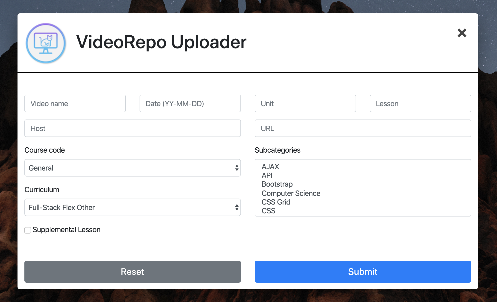

# VideoRepo Uploader v.1.0.0



## What is VideoRepo?

I am a MERN stack and UX/UI bootcamp instructor and have been in the classroom for 3+ years. I have amassed quite a collection of lectures and supplementary videos and wanted a way to share them all with current and former students. So in turn, I built this online video repository where video links are stored in a Mongo database and displayed easily and with filter capabilities. All protected by a password, so only students and faculty can get access.

### VideoRepo Uploader

Written using Electron, Uploader is the primary backend user interface for adding new videos to the database without having to use something like MongoDB Compass.

VideoRepo Uploader...

- Uses an API key to authenticate requests to and from the server
- Retrieves a list of all classes, subcategories, and curricula from the server
- Posts new videos to the server

## `videorepo_uploader.json` Config File Template

This is the template for the config.json file, on which Uploader relies.

Uploader expects this config.json file to be located in `~/config/videorepo_uploader.json`.

```
{
    "APIKEY": "key",
    "DOMAINROOT": "https://apiserverurl.com/",
    "TOKEN": 0
}
```

## Build Instructions

To build the application, run `yarn build` in the application directory. Currently the build script is for macOS only, but uses electron-packager which will allow you to build for any platform if you change the script arguments.

## VideoRepo Server and Frontend

Uploader is the backend application for adding new videos to the database. You can find the VideoRepo Express server and the frontend React web app [here (hannahpatellis/videorepo)](https://github.com/hannahpatellis/videorepo).

### Enjoy! 👩🏻‍🏫

---

### Take a look at some of my other classroom apps!

[Plume](https://github.com/hannahpatellis/plume): A React app for generating random groups and displaying a countdown timer

[HoDO Dashboard](https://github.com/hannahpatellis/hodo_dashboard) and [HoDO Desktop](https://github.com/hannahpatellis/hodo_desktop): A MERN stack web app for keeping track of and administering house points, challenges, and guidelines for the Houses of Design Olympics game for UX/UI bootcamps; and an Electron app for quickly adding new points.

[House Points Dashboard for Coding Bootcamps](https://github.com/hannahpatellis/gthousedash): The original incarnation of the Houses of Design Olympics, made for Full-Stack Flex bootcamps. *(No longer in use.)*

---

Developed by Alexandria 'Hannah' Isadora Patellis in 2018

[hannahap.com](https://hannahap.com)